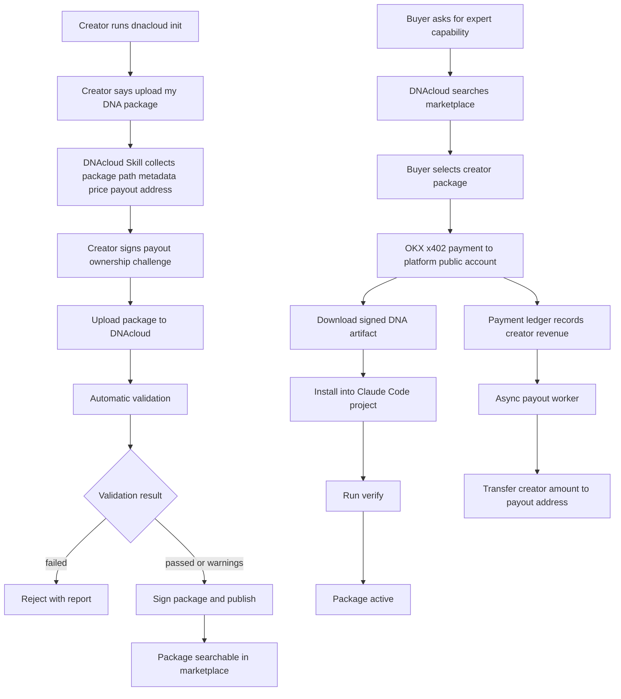

# DNAcloud for Claude Code 产品方案 v0.6

更新时间：2026-05-07  
版本主题：Creator Upload & Revenue Settlement  
上一个版本：v0.5 完成 DNAcloud Bootstrap + 官方 Trading Master DNA 购买/安装主流程。  
本版本目标：让普通用户也可以把自己的 DNA 包上传到 DNAcloud 仓库，通过自动审核后上架；买家购买后资金先进入平台公共账户，再由平台异步结算给 DNA 提供者的收款地址。

---

## 1. 本版核心结论

v0.6 不改变 v0.5 的购买和安装主流程，而是在其上新增一条 **创作者上传路径**：

```text
创作者安装 DNAcloud Bootstrap
→ 通过 Claude Code 内的 DNAcloud Skill / CLI 上传自己的 DNA 包
→ 提交价格、描述、分类、收款地址
→ 平台自动校验包结构、安全风险、收款地址和 manifest
→ 校验通过后进入 DNAcloud 仓库并可被搜索购买
→ 买家通过 OKX x402 支付给平台公共账户
→ 平台返回签名 DNA 包给买家安装
→ 平台账本记录创作者应收金额
→ 公共账户异步打款到该 DNA 包配置的创作者收款地址
```

本版本仍然不是做“专家包内容质量”的阶段。DNAcloud 的重点是基础服务：上传、校验、上架、购买、安装、收款、结算。Trading Master DNA 可以继续作为官方包存在，但 v0.6 的核心是 **第三方 DNA 包上传和收益结算能力**。

---

## 2. 产品一句话

**DNAcloud 是 Claude Code 的专家能力包市场。用户可以购买并安装 DNA 包；创作者也可以通过 DNAcloud Skill 上传自己的 DNA 包和收款地址，自动审核通过后上架，并在别人购买后获得异步结算。**

---

## 3. 角色定义

### 3.1 买家 Buyer

买家是使用 Claude Code 的普通用户。他的目标是：

```text
我想让 Claude Code 获得某种专家能力，例如交易、合同审查、电商运营、代码审计。
```

买家通过 DNAcloud Bootstrap 搜索、支付、下载并安装 DNA 包。

### 3.2 创作者 Creator

创作者也是 Claude Code 用户。他的目标是：

```text
我已经做了一个有价值的 DNA 包，希望上传到 DNAcloud，让其他用户付费安装。
```

创作者可以是：

```text
交易策略作者
电商老师
法律顾问
投研分析师
代码审计专家
企业内部流程维护者
MCP 工具提供者
```

### 3.3 平台 Platform

平台提供：

```text
DNA 仓库
自动审核
包签名
搜索索引
OKX x402 收款
下载授权
交易账本
异步创作者结算
```

---

## 4. v0.6 用户体验总览

### 4.1 创作者上传体验

创作者已经安装 Claude Code，然后运行：

```bash
dnacloud init
```

在 Claude Code 中说：

```text
我要上传一个自己的 DNA 包。
```

DNAcloud Skill 触发后引导：

```text
1. 选择本地 DNA 包路径
2. 读取 manifest.json
3. 检查包结构
4. 要求填写价格、分类、简介、版本
5. 要求填写创作者收款地址
6. 要求创作者签名确认该收款地址归属
7. 上传到 DNAcloud
8. 平台自动审核
9. 通过后发布到市场
10. 返回上架链接和 package id
```

也可以用 CLI：

```bash
dnacloud creator login --wallet 0xCreatorAddress
dnacloud upload ./my-dna-package.zip \
  --price 1.00 \
  --currency USDG \
  --payout-address 0xCreatorAddress \
  --category trading
```

上传成功后返回：

```text
DNA package published.

Package: conservative-trading-assistant
Version: 1.0.0
Creator payout address: 0xCreatorAddress
Price: 1.00 USDG
Validation: passed with warnings
Status: published
Marketplace URL: dnacloud://package/conservative-trading-assistant
```

---

### 4.2 买家购买体验

买家说：

```text
我要一个适合新手的交易助手。
```

DNAcloud 搜索市场，结果里会同时出现官方包和创作者包：

```text
1. Trading Master DNA Official
   Publisher: DNAcloud Official
   Price: 1.00 USDG
   Status: verified official

2. Conservative Crypto Trading Assistant
   Publisher: 0xCreatorAddress
   Price: 1.00 USDG
   Status: auto-reviewed

3. Onchain Risk Guard Lite
   Publisher: 0xAnotherCreator
   Price: 0.30 USDG
   Status: auto-reviewed
```

买家选择第 2 个后：

```text
1. 展示包详情
2. 展示安装预览
3. 展示自动审核报告
4. 展示权限影响
5. 展示价格和支付资产
6. 通过 OKX x402 支付给 DNAcloud 公共账户
7. 下载包
8. 校验平台签名
9. 安装到当前 Claude Code 项目
10. 运行 verify
```

---

## 5. v0.6 新增功能清单

### 5.1 Creator Upload

创作者可以上传 DNA 包：

```text
manifest.json
install-plan.json
skills/
agents/
commands/
mcp/
hooks/
rules/
tests/
signature.txt 或 package.sha256
```

v0.6 支持 zip 格式。tar/tgz 可留作后续版本。

---

### 5.2 自动审核

v0.6 只做简单自动审核，但必须可运行、可记录、可解释。

审核内容：

```text
包结构是否正确
manifest 是否符合 schema
版本号是否合法
package id 是否冲突
文件路径是否越界
是否包含私钥、助记词、API key
是否包含明显危险脚本
是否包含未知大文件
hooks 是否声明权限影响
MCP 配置是否显式列出 endpoint 和工具
收款地址格式是否正确
收款地址是否完成签名验证
价格和币种是否符合平台支持范围
```

审核结果：

```text
passed
passed_with_warnings
failed
```

第一期可以允许 `passed_with_warnings` 上架，但买家安装前必须看到警告。

---

### 5.3 收款地址验证

创作者上传时必须提交收款地址。为了避免别人乱填第三方地址，平台要求创作者用该地址签名一段上传挑战：

```text
dnacloud-upload:<nonce>:<package_hash>:<payout_address>
```

平台验证签名后，才接受该地址作为当前 DNA 包的收款地址。

---

### 5.4 平台公共账户收款

买家下载 DNA 包时，不直接付款给创作者地址，而是通过 OKX x402 支付到平台公共账户。

原因：

```text
统一支付体验
统一退款/争议/风控入口
统一收入账本
统一平台抽成
统一异步结算
便于对账和审计
```

平台公共账户收到款后，记录应收账本。

---

### 5.5 异步创作者结算

买家购买后，平台生成一条收入记录：

```text
buyer_payment_id
package_id
package_version
creator_id
payout_address
gross_amount
platform_fee
creator_amount
currency
network
status: pending_payout
```

结算服务异步把 `creator_amount` 从平台公共账户转到 `payout_address`。

v0.6 可采用简单策略：

```text
每笔购买生成一条 pending payout
后台 worker 周期性扫描 pending payout
按创作者地址和币种聚合
发起链上转账
记录 tx hash
更新 payout status
```

---

## 6. DNA 包上架状态

```text
draft           本地草稿，未上传
uploaded        已上传，等待自动校验
rejected        校验失败
published       校验通过并已上架
suspended       平台暂停展示
deprecated      创作者废弃该版本
```

v0.6 不做复杂人工审核，但必须保留 `suspended` 字段，以便后续平台能下架恶意包。

---

## 7. 创作者收益状态

```text
pending_payout      已产生收入，等待结算
payout_processing   正在打款
paid                已打款
payout_failed       打款失败
held                风控暂缓
```

创作者可以查询：

```bash
dnacloud creator earnings
dnacloud creator payouts
dnacloud creator packages
```

返回：

```text
Total gross sales: 12.00 USDG
Platform fee: 2.40 USDG
Pending payout: 9.60 USDG
Paid payout: 0.00 USDG
Payout address: 0xCreatorAddress
```

---

## 8. 收费和分成模型

v0.6 默认模型：

```text
买家支付金额 = DNA 标价
平台公共账户收款 = DNA 标价
创作者应收 = DNA 标价 * creator_share
平台收入 = DNA 标价 * platform_fee
```

默认建议：

```text
platform_fee = 20%
creator_share = 80%
```

但技术上要配置化：

```text
package_fee_rate
creator_fee_rate
minimum_payout_amount
payout_interval
```

---

## 9. 为什么不让买家直接付给创作者

v0.6 选择平台公共账户收款，而不是买家直接付创作者，原因是：

```text
买家体验简单，只需信任 DNAcloud 支付入口
平台可以统一校验支付和授权下载
平台可以做退款、争议和风控
平台可以聚合小额收入降低结算成本
平台可以统一记录销售数据和分成
平台可以避免创作者在包里伪造收款逻辑
```

后续版本可以支持：

```text
creator direct settlement
split payment
smart contract escrow
revenue share contract
```

但 v0.6 不做。

---

## 10. 上传包的最低要求

一个可上架 DNA 包至少需要：

```text
manifest.json
install-plan.json
README.md 或 description.md
至少一个 skills/<name>/SKILL.md 或 agents/<name>.md 或 commands/<name>.md
rules/permissions.json
tests/conformance-tests.json
```

如果包只是一堆 Markdown，没有 skill/agent/command，允许上传但不推荐上架，v0.6 可以标记为：

```text
low_capability_package
```

买家安装前会看到：

```text
This DNA package does not install any Claude Code Skill, Agent, Command, MCP, or Hook. It may have limited runtime effect.
```

---

## 11. 风险边界

v0.6 必须明确：

```text
自动审核不是人工背书
平台签名代表包未被篡改，不代表内容质量保证
创作者收入可能延迟结算
高风险包可以被平台暂停
上传者必须确认拥有内容分发权
收款地址一旦用于某版本，不应被静默修改
```

禁止：

```text
上传含私钥、助记词、API key 的包
上传诱导用户泄露密钥的包
上传绕过支付、绕过权限、绕过风控的包
上传声称保证收益、保证胜诉、保证治愈等高风险承诺的包
上传侵犯第三方版权或付费资料的包
```

---

## 12. v0.6 用户流程图



---

## 13. v0.6 验收标准

### 创作者侧

```text
创作者可以通过 CLI 或 Claude Code Skill 上传包
创作者可以提交收款地址
平台可以验证收款地址签名
平台可以自动审核包
审核报告可查看
审核通过后包可被搜索
```

### 买家侧

```text
买家可以搜索到创作者包
买家可以查看自动审核报告
买家可以用 OKX x402 支付购买
买家可以下载并安装该包
安装后 verify 可以通过
```

### 平台侧

```text
支付进入平台公共账户
每笔购买产生收入账本
账本能计算平台收入和创作者应收
payout worker 可以把应收资金转到创作者收款地址
payout tx hash 可追踪
失败可重试且幂等
```

---

## 14. v0.6 不做的事情

```text
不做复杂人工审核后台
不做完整创作者主页 UI
不做智能推荐排序
不做创作者信誉评分
不做退款/争议处理
不做链上分账合约
不做直接付款给创作者
不做复杂税务处理
不做包内容盈利能力评估
```

---

## 15. 下一版本预留

v0.7 可以做：

```text
创作者主页
包评分和评论
人工审核队列
包举报/下架机制
按版本差分更新
创作者直接上架工作台
按类目模板创建 DNA
智能安全扫描升级
收益 dashboard
退款/争议流程
```
