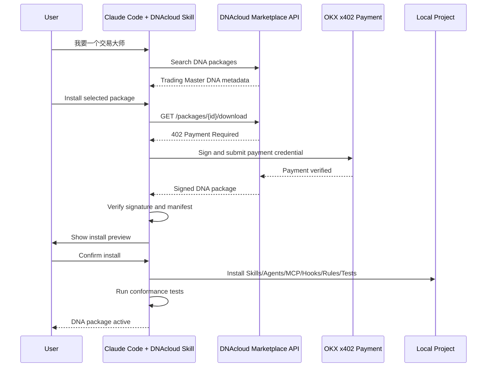
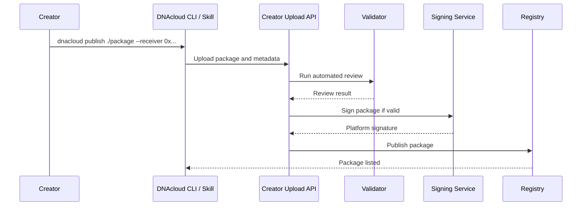
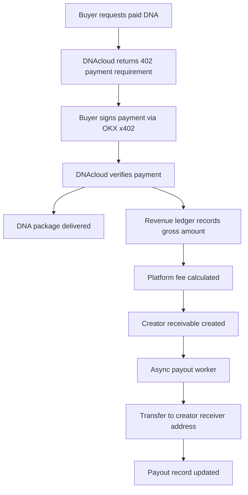

# DNAcloud 技术架构说明

## 1. 系统组件

```text
Claude Code Project
  ├── DNAcloud Bootstrap Skill
  ├── DNAcloud CLI
  ├── Installed DNA Packages
  └── Verification Records

DNAcloud Cloud
  ├── Marketplace API
  ├── Package Registry
  ├── Package Validator
  ├── Signing Service
  ├── OKX x402 Payment Integration
  ├── Creator Upload API
  ├── Revenue Ledger
  └── Async Payout Worker
```

## 2. 买家下载流程



## 3. 创作者上传流程



## 4. 支付与结算流程



## 5. DNA 包结构

```text
my-dna-package/
  manifest.json
  install-plan.json
  signature.txt
  skills/
  agents/
  commands/
  mcp/
  hooks/
  rules/
  tests/
  memory/
```

## 6. 第一阶段 API

```text
GET  /api/packages/search
GET  /api/packages/:id/manifest
GET  /api/packages/:id/download       # protected by OKX x402
POST /api/creator/packages/upload
POST /api/creator/packages/:id/publish
GET  /api/creator/packages/:id/status
GET  /api/ledger/creator/:address
POST /api/admin/payouts/run           # worker/internal
```

## 7. 本地安装路径

```text
.claude/
  skills/
  agents/
  commands/
  settings.local.json

.mcp.json

.dnacloud/
  config.json
  installed/
    <package-id>/
      manifest.json
      install-record.json
      verify-result.json
      rollback.json
```
